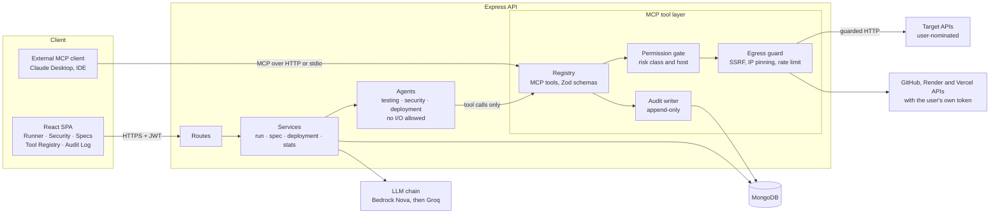
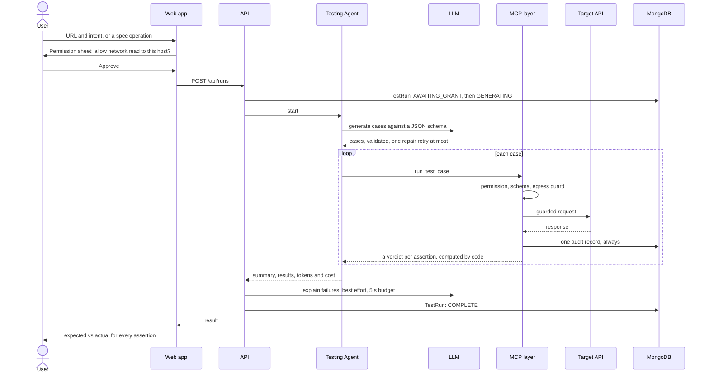

<div align="center">


### API testing and security validation by AI agents that can only act through an audited, permission-gated tool layer

[](https://github.com/adarshcod30/AGENTIQ/actions/workflows/ci.yml)
[](LICENSE)
[](.nvmrc)
[](https://modelcontextprotocol.io)
[](https://github.com/adarshcod30/AGENTIQ/commits/main)

[**Quick start**](#quick-start) · [**How it works**](#how-it-works) · [**Evaluation**](#evaluation) · [**Docs**](docs/) · [**Report a bug**](https://github.com/adarshcod30/AGENTIQ/issues)

</div>

---

Paste an API URL and a sentence describing what the endpoint should do. AGENTIQ generates test
cases with an LLM, **executes** them, and runs a six-family OWASP security scan. Point it at a whole
project instead, a local folder, a GitHub repo, or a deployed URL, and it discovers the routes,
tests them, scans them, and judges whether the project is ready to deploy, then deploys it to your
own Render or Vercel and re-tests the URL that goes live. None of that is new on its own. What is
different is the rule underneath it: **an agent never touches the network itself.** Every request goes
through a registered [MCP](https://modelcontextprotocol.io) tool that validates its input,
checks your permission for that host, refuses private and cloud-metadata addresses, and writes an
append-only audit record. You can open the Audit Log and see exactly what the AI did, and why it
was allowed to.

**Keywords:** `api-testing` `security-testing` `owasp-api-top-10` `mcp` `model-context-protocol`
`llm-agents` `ssrf` `openapi` `amazon-bedrock` `express` `react`

## Table of contents

- [The problem](#the-problem)
- [Key features](#key-features)
- [Quick start](#quick-start)
- [How it works](#how-it-works)
- [The security model](#the-security-model)
- [Evaluation](#evaluation)
- [Tech stack](#tech-stack)
- [Deployment and infrastructure](#deployment-and-infrastructure)
- [Project structure](#project-structure)
- [Configuration](#configuration)
- [API reference](#api-reference)
- [Testing](#testing)
- [Known limitations](#known-limitations)
- [Roadmap](#roadmap)
- [Contributing](#contributing)
- [License](#license)
- [Author](#author)

## The problem

- **Fragmented tooling.** Functional tests live in Postman, security tests in ZAP, and deployment
  verification nowhere. Knowing whether an endpoint is correct *and* safe *and* live means three
  workflows and correlating the results by hand.
- **Manual authoring.** Hand-written assertions are slow and biased toward whatever the author
  thought of. Boundary and negative cases are exactly the ones people skip.
- **Unaccountable automation.** The moment an LLM takes actions against a live endpoint, you have
  a machine firing HTTP requests on someone's behalf. Without a permission model and an audit
  trail, that is not a testing tool, it is a liability, and most agent demos ignore it.

The third problem is the one AGENTIQ is built around.

## Key features

| Feature | What it does |
|---|---|
| **Testing Agent** | Turns a URL and plain-English intent into executable test cases with multi-assertion checks (status, JSONPath, headers, body, response time). The LLM proposes assertions; code decides pass or fail, deterministically. |
| **Spec grounding** | Import an OpenAPI 3.0 or 3.1 document and ground generation in an operation's declared parameters, schemas and status codes. |
| **Security Agent** | Six probe families mapped to the OWASP API Security Top 10 (2023): SQL injection, reflected XSS, broken authentication, CORS, security headers, rate limiting. Every finding carries its payload, the signal that fired, and the baseline it deviated from. |
| **False-positive control** | Each probe compares against a benign baseline, and an "intended to be public" declaration stops the auth probe from flagging every public API. |
| **MCP tool layer** | Nineteen registered tools with Zod schemas, six risk classes, per-host grants, a filesystem jail and process sandbox for local analysis, an SSRF egress guard, and an append-only audit log. Also served as an MCP server, so Claude Desktop or an IDE can drive the same tools. |
| **Deployment Agent** | Read-only preflight against GitHub, then a deploy to **Render or Vercel using the user's own connected account**, then an automatic test and scan of the live URL, all recorded together. |
| **Autonomous assessment** | Register a project as a local folder, a public or private GitHub repo (shallow-cloned in the background, statically scanned, never executed), or a deployed URL, and AGENTIQ discovers its routes, starts it or targets the live URL, tests every endpoint, runs the security scan, and judges readiness to deploy, with prioritised guidance on what to fix and why. |
| **Bring your own accounts** | Multi-tenant. Each user connects their own GitHub, Render and Vercel from the UI, by OAuth or a pasted token, encrypted at rest and never returned. Private repos clone with the user's token, and deploys go to the user's own account, no shared platform key. |
| **Live testing** | When an app needs environment variables to boot, provide them by hand or **load them from the project's own `.env`** (stored server-side, never returned) and re-run, so its endpoints are tested against the running app. A deployed URL or a cloned repo is never sent test writes. |
| **Trust pages** | A Tool Registry that renders live JSON Schemas from the server, and an Audit Log where denied and SSRF-blocked calls stand out. |
| **Real dashboard** | Every figure is a MongoDB aggregation over your own runs. A new account shows honest zeros. |
| **Evaluation harness** | `npm run evaluate` measures precision and recall on labelled fixture apps, a mutation score for generated suites, and a grounding ablation. |

## Quick start

Runs locally in about five minutes with a free Groq key and no AWS account. You need
**Node 22.12+** and **Docker** (for MongoDB).

```bash
git clone https://github.com/adarshcod30/AGENTIQ.git
cd AGENTIQ
npm ci
docker run -d --name agentiq-mongo -p 27017:27017 mongo:7
cp .env.example server/.env
```

Edit `server/.env` and set these six values ([get a Groq key](https://console.groq.com), free):

```bash
MONGO_URI=mongodb://127.0.0.1:27017/agentiq
JWT_SECRET=<run: node -e "console.log(require('crypto').randomBytes(48).toString('base64url'))">
GROQ_API_KEY=<your key>
LLM_PRIMARY=groq
LLM_FALLBACK=bedrock
ALLOW_PRIVATE_TARGETS=true
```

Then start everything, and in a second terminal the two fixture APIs to test against:

```bash
npm run dev
```

```bash
npm run fixtures
```

Open **http://localhost:5173**, register, and point a run at `http://127.0.0.1:4001/users/1`
(the deliberately vulnerable fixture) or at `http://127.0.0.1:4002/users/1` (the hardened one).
More detail in [docs/08_COLLABORATOR_SETUP.md](docs/08_COLLABORATOR_SETUP.md).

> `ALLOW_PRIVATE_TARGETS=true` lets the server reach the fixtures on localhost. The server
> **refuses to boot** with it in production, and the cloud-metadata range stays blocked even when
> it is on.

## How it works

The browser talks to an Express API. Routes hand work to services, and `run.service` drives a
**state machine** for each run. Services call the **agents**, which are thin orchestration with
one hard rule: they contain no I/O. Every outbound request an agent causes goes through the
**MCP tool layer**, where one wrapper (`withGuards`) checks the user's permission, validates the
input against the tool's Zod schema, lets the handler reach the network only through the **egress
guard**, and writes exactly one audit record, even when the call throws. The LLM sits beside
this, not inside it: it is called by the services with fixed provider endpoints, never with a URL
a user supplied.



### What happens during a run



Every terminal state is stored, including failures: a run that could not generate cases is
recorded as `GEN_FAILED` with the reason, never replaced by fabricated tests. The full state
machine is in [docs/03_App_Flow.md](docs/03_App_Flow.md).

### Assessing a whole project

A single run tests one endpoint; an **assessment** takes a whole project end to end. Register it as
a local folder, a public or private GitHub repo, or a deployed URL, and AGENTIQ walks a persisted
state machine: **discover** the routes from the source (an AST pass, no LLM), **test** every
endpoint (it starts the app in the process sandbox, or targets the deployed URL, or, for a cloned
repo, runs static-only because that code is untrusted), **scan** with the six probe families plus
static secret, SAST, dependency and config analysis, then **judge readiness** and assemble a report
with prioritised guidance: for each finding, why it matters, how to fix it, and concrete tips. A
GitHub repo clones in the background, so the request never blocks: the project shows a live
`cloning` status and flips to `ready` on its own. If the app cannot boot because it needs
environment variables, provide them (by hand or from the project's own `.env`) and re-run.

### Bring your own accounts

AGENTIQ is multi-tenant: it never deploys with a shared key or clones a private repo with a platform
token. Each user connects their **own** GitHub, Render and Vercel in Settings, either by OAuth
("Connect with GitHub") or by pasting a personal token. The token is encrypted at rest and used only
server-side, for that user's private clones and their deploys to their own hosting. The API only
ever reports which providers are connected and the last four characters, never a token.

## The security model

A tool that fetches URLs a user typed is an SSRF engine unless something stops it. AGENTIQ stops it
in three layers.

**1. Permissions, by risk class and host.** Asking someone to approve every tool one at a time is
theatre. Asking "may this app send attack-indicator payloads to `api.example.com`?" is a real
decision.

| Risk class | Meaning | Default |
|---|---|---|
| `local.compute` | No network: parsing, evaluation | granted automatically |
| `local.fs.read` | Reads inside the one project workspace, jail-bounded | granted automatically |
| `local.process` | Runs the project as a sandboxed loopback process | granted automatically |
| `network.read` | A benign request to a host you nominated | granted per host |
| `network.probe` | Attack-indicator payloads to a host you nominated | **explicit, per host, per session; never automatic** |
| `deploy.write` | Changes external infrastructure | explicit grant plus confirmation |

**2. The egress guard** (`server/src/mcp/egress.js`). Only `http` and `https`. DNS is resolved
first and **every** resolved address is checked against loopback, private, link-local (the cloud
metadata range), carrier-grade NAT, multicast and reserved ranges, for IPv4 and IPv6, including
IPv4-mapped addresses like `::ffff:127.0.0.1`. The checked IP is then **pinned** for the actual
connection, so DNS rebinding cannot swap it between check and fetch. Redirects are capped at 3
and re-validated hop by hop, with a 10 s timeout, a 5 MB cap and a 5 requests-per-second limit
per host.

**3. The audit log.** Every call writes one record: tool, risk class, host, a SHA-256 of the input
(never the raw payload, which may hold credentials), outcome and duration. There is no update or
delete path in the API, and the schema refuses updates too.

**4. The filesystem jail, untrusted code, and credentials at rest.** Reading a project's files is
bounded by a jail (`server/src/mcp/fsJail.js`), the exact analogue of the egress guard: the resolved
real path, symlinks followed, must sit inside the workspace, so a tool asked for
`../../.aws/credentials` is refused. A GitHub repo is cloned as **untrusted** code (`trusted: false`)
and statically scanned, but its app is never started, so none of its scripts run. And every
third-party token a user connects is encrypted at rest with **AES-256-GCM** (a random IV and auth
tag, key derived from `JWT_SECRET`), stored `select:false`, decrypted only server-side for a deploy
or a private clone, and never returned to the browser.

The rule that agents contain no I/O is not left to discipline. `server/tests/architecture.test.js`
fails the build if an HTTP client or process API appears in the agents, routes or controllers.

## Evaluation

`npm run evaluate` drives the **real** agents through the **real** tool layer (the same
permission gate, egress guard and audit writer) against two fixture APIs built for this: a
deliberately **vulnerable** one and a **hardened** one with the identical contract. A shared
contract test proves they differ only in their defects. Full results, per-mutant tables and raw
observations: [docs/90_EVALUATION.md](docs/90_EVALUATION.md).

### Security detection

48 labelled observations: 4 endpoints, on both apps, across all 6 families.

| | True pos. | False pos. | False neg. | True neg. | Precision | Recall |
|---|--:|--:|--:|--:|--:|--:|
| **All 6 families** | 16 | **0** | 0 | 32 | **100%** | **100%** |

Zero findings on the hardened app, and the auth probe correctly stays quiet on the three
endpoints declared public. Treat these as what they are: a small benchmark with defects that are
meant to be detectable. They show the false-positive controls work; they are not a claim about
arbitrary real-world APIs.

### Test-generation adequacy

The hardened app is seeded with 8 behavioural mutations (a wrong status code, a missing field, a
wrong type, a wrong content type, a missing auth check, an off-by-one filter), and each generated
suite is scored on how many it catches. This adapts the mutation-score method from RESTestBench
(arXiv 2604.25862).

| | Spec-grounded | Description-only |
|---|--:|--:|
| **Mutation score, mean of 3 paired runs** | **50.0%** | 43.3% |
| Assertions generated | 141 | 124 |
| Paired runs won / tied / lost | 2 / 1 / 0 | |

Grounding helped in every run it did not tie, which is **suggestive, not significant** at 3
repeats. The more useful finding is what *neither* arm ever catches: a field returned as the wrong
type, a wrong content type, and an off-by-one filter. Those are the next things for the prompt to
learn.

### Cost and latency

| | |
|---|--:|
| Model | Amazon Nova Lite on Bedrock |
| Mean generation latency | 2.5 s |
| Cost of the entire evaluation run | **$0.0043** (27,815 tokens) |
| Audited tool invocations | 522 |

## Tech stack

| Layer | Technology |
|---|---|
| Frontend | React 19, Vite 8, TypeScript, Tailwind CSS 4, TanStack Query, React Router 7, Recharts 3 |
| Backend | Node.js 22, Express 5, Mongoose 9, Zod 4, Passport (Google OAuth 2.0), Pino |
| Agent tooling | Model Context Protocol SDK (streamable HTTP and stdio), Swagger Parser |
| LLM | Amazon Bedrock (Nova, Converse API) with Groq as fallback |
| Database | MongoDB Atlas |
| Email | Nodemailer over Gmail SMTP, or Resend |
| Testing | Vitest, Supertest, mongodb-memory-server, v8 coverage |
| CI | GitHub Actions |
| Infrastructure | Docker; AWS App Runner, S3 + CloudFront and ECR as the deployment target |

Exact versions and the reasoning behind each choice: [docs/02_TRD.md](docs/02_TRD.md) §2.

## Deployment and infrastructure

- **Status:** there is no public deployment yet. The API is packaged as a container (`Dockerfile`:
  non-root user, production dependencies only, exec-form start so it shuts down cleanly on
  `SIGTERM`). Run it locally with the [quick start](#quick-start).
- **CI:** every push and pull request runs install, lint, typecheck, the full test suite, a 70%
  coverage gate on the MCP layer and agents, and `npm audit` at high severity
  ([`ci.yml`](.github/workflows/ci.yml)).
- **Target hosting:** API on AWS App Runner, frontend on S3 + CloudFront, images in ECR, the
  database on MongoDB Atlas. App Runner rather than Lambda, because a security scan is long-running
  and the per-host rate limiter needs one process's shared state.
- **Planned CD:** GitHub Actions with OIDC, so no long-lived AWS keys are ever stored in GitHub.
- **Monitoring:** structured Pino logs with secret redaction; `GET /api/health` reports database
  status and the resolved LLM chain, and a scheduled workflow pings it to avoid cold starts.
- **Cost:** about $6 to $11 a month at low traffic, almost all of it App Runner. LLM spend is
  well under a dollar for a thousand runs.

Architecture, cost breakdown and setup: [docs/05_AWS_ARCHITECTURE.md](docs/05_AWS_ARCHITECTURE.md)
and [docs/07_DEPLOYMENT_CHECKLIST.md](docs/07_DEPLOYMENT_CHECKLIST.md).

## Project structure

```
AGENTIQ/
├── server/                  Express API
│   ├── src/
│   │   ├── agents/          testing · security · deployment · discovery · intent (no I/O)
│   │   ├── mcp/             registry · permissions · audit · egress guard · fs jail · IP rules
│   │   │   ├── tools/       one file per MCP tool
│   │   │   ├── analysis/    secret · SAST · config · dependency · route discovery
│   │   │   └── probes/      baseline differential · database error fingerprints
│   │   ├── deploy/          provider registry · render · vercel · railway
│   │   ├── services/        run · assessment · discovery · git · connections · oauth · crypto · deployment · LLM · stats
│   │   ├── models/          User · TestRun · ApiSpec · AuditEvent · Deployment · Project · Discovery · Assessment · Connection · Grant
│   │   ├── routes/  controllers/  middleware/  config/  lib/  utils/
│   └── tests/               626 tests
├── web/                     React SPA
│   └── src/                 pages · components · hooks · services · store · types
├── fixtures/                vulnerable-api and hardened-api, with a shared contract test
├── evaluation/              npm run evaluate, and the raw results behind docs/90_EVALUATION.md
├── docs/                    product, design, setup and evaluation documents
├── scripts/                 logo generator
└── Dockerfile
```

## Configuration

Every variable is validated with Zod at boot. The server prints a table of what is set and what is
missing, and exits if a required one is absent. Only two are required.

| Variable | Required | Purpose |
|---|---|---|
| `MONGO_URI` | yes | MongoDB connection string |
| `JWT_SECRET` | yes | At least 32 characters; there is no fallback |
| `LLM_PRIMARY`, `LLM_FALLBACK` | | `bedrock` and `groq`, in either order |
| `BEDROCK_MODEL_ID`, `AWS_REGION` | | A Bedrock **inference profile** id, e.g. `apac.amazon.nova-lite-v1:0` |
| `GROQ_API_KEY` | | The Groq provider |
| `GOOGLE_CLIENT_ID`, `GOOGLE_CLIENT_SECRET` | | Google sign-in; the server boots without them |
| `MAIL_DRIVER`, `GMAIL_USER`, `GMAIL_APP_PASSWORD` | | Verification email |
| `RENDER_API_KEY` | | Platform-default Render deploys, a fallback; each user connects their own |
| `GITHUB_OAUTH_CLIENT_ID`, `GITHUB_OAUTH_CLIENT_SECRET` | | "Connect with GitHub" OAuth; token paste works without it |
| `VERCEL_CLIENT_ID`, `VERCEL_CLIENT_SECRET` | | "Connect with Vercel" OAuth; token paste works without it |
| `ALLOW_PRIVATE_TARGETS` | | Local fixtures only; refused in production |

AWS credentials never go in `.env`: the SDK uses its default credential chain. The full list is in
[`.env.example`](.env.example). Setup guides: [infrastructure](docs/06_SETUP.md),
[Google sign-in and email](docs/06_SETUP_AUTH.md).

## API reference

Every response uses one envelope: `{ success: true, data }` or
`{ success: false, error: { code, message } }`.

| Method | Path | Purpose |
|---|---|---|
| `POST` | `/api/auth/register` · `/api/auth/login` | Create an account, sign in |
| `POST` | `/api/mcp/grants` | Grant a risk class for a host |
| `POST` | `/api/runs` | Generate, execute and optionally scan |
| `GET` | `/api/runs` · `/api/runs/:id` | History and detail, scoped to you |
| `POST` | `/api/security/scan` | Security scan only |
| `POST` | `/api/specs/import` | Import an OpenAPI document |
| `POST` | `/api/deployments/preflight` · `/api/deployments` | Check, then deploy and verify |
| `POST` `GET` | `/api/projects` | Register a project (folder, deployed URL, or GitHub repo) and list |
| `POST` `GET` | `/api/assessments` · `/api/assessments/:id` | Run and read an autonomous assessment |
| `GET` `PUT` `DELETE` | `/api/connections` · `/api/connections/:provider` | Your own GitHub/Render/Vercel tokens; presence out only |
| `GET` | `/api/mcp/tools` | The live tool registry with JSON Schemas (public) |
| `GET` | `/api/mcp/audit` | The audit log |
| `GET` | `/api/health` | Liveness, database and LLM chain (public) |

A run from the command line, against the local vulnerable fixture:

```bash
API=http://localhost:3001/api

curl -s $API/auth/register -H 'Content-Type: application/json' \
  -d '{"displayName":"Dev","email":"dev@example.com","password":"a-long-password","confirmPassword":"a-long-password"}'

TOKEN=$(curl -s $API/auth/login -H 'Content-Type: application/json' \
  -d '{"email":"dev@example.com","password":"a-long-password"}' | jq -r .data.token)

# Without this grant the run is cancelled before a single packet leaves.
curl -s $API/mcp/grants -H "Authorization: Bearer $TOKEN" -H 'Content-Type: application/json' \
  -d '{"riskClass":"network.read","host":"127.0.0.1:4001"}'

curl -s $API/runs -H "Authorization: Bearer $TOKEN" -H 'Content-Type: application/json' \
  -d '{"url":"http://127.0.0.1:4001/users/1","method":"GET","description":"Returns one user by id; 404 for an unknown id"}'
```

Every endpoint, with its purpose and auth requirement: [docs/02_TRD.md](docs/02_TRD.md) §10.

## Testing

```bash
npm test                                   # 626 server tests and 24 fixture contract tests
npm --workspace server run test:coverage   # enforces 70% on src/mcp and src/agents
npm run lint
npm run typecheck
```

The suite runs against an in-memory MongoDB and a stubbed LLM, so it needs no credentials and no
network. It covers the assertion evaluator, JSON repair, one test per blocked address range, the
permission gate, every probe family against both fixtures, the run state machine, audit
completeness, both MCP transports, and the architecture guard. Coverage is about 80% overall.

## Known limitations

- **No public deployment yet**, and the `Dockerfile` has not been built in CI.
- **The benchmark is small.** Four endpoints on two purpose-built apps. The 100% precision and
  recall show the false-positive controls working, not general-case performance.
- **Generated suites miss three kinds of bug**: wrong types, wrong content types and off-by-one
  boundaries are never caught.
- **Permission grants now survive a restart** (write-through to MongoDB, re-hydrated on boot, expired
  by a TTL index on the same one-hour clock), but a live grant is still not shared between instances:
  the in-memory store is per-process. Sharing live grants across a horizontally scaled deployment is
  out of local scope.
- **The health check reports configuration, not credentials.** An expired AWS session shows up only
  when calls fall back to Groq.
- **Detection only.** No exploitation, and no model of business logic, so logic flaws are out of
  reach.
- **Live deploys need the user's own token to prove out.** Render is fully wired and tested against a
  fake control plane; Vercel's provider is coded against Vercel's API and tested the same way, so a
  first real Vercel deploy may need a small request-shape tweak. OAuth "Connect" needs an OAuth app
  registered on the provider, and Render has no such flow, so Render is token paste only.
- Not handled yet: an idempotency key on run submission, a per-user concurrent-run limit, and
  paging through very long operation lists.
- The frontend is type-checked and built in CI but has no unit tests.

## Roadmap

- [ ] Deploy to App Runner and S3 + CloudFront behind an OIDC pipeline
- [x] Assess a whole project: a local folder, a public or private GitHub repo (background clone), or a deployed URL
- [x] Multi-tenant: connect your own GitHub, Render and Vercel (encrypted at rest), by OAuth or token
- [x] Deploy to Vercel, not just Render, using the user's own account
- [x] Persist permission grants so they survive restarts (done); sharing live grants across scaled instances remains
- [ ] Render OAuth (no general OAuth-token flow today, so Render stays token paste)
- [ ] Teach generation to assert on types, content types and boundaries
- [ ] Grow the benchmark (more endpoints, more repeats) to settle the grounding result
- [ ] A health check that verifies provider credentials, not just configuration
- [ ] Run-submission idempotency and a concurrent-run limit
- [ ] API client: save requests, promote one to a test case, scan an endpoint in one click
- [ ] Frontend tests
- [ ] Secrets Manager for production secrets

## Contributing

Issues and pull requests are welcome.

1. Fork the repository and create a branch (`git checkout -b fix-something`).
2. Keep the one architectural rule: agents make no network calls; add a tool instead.
3. Run `npm run lint`, `npm run typecheck` and `npm test` before opening a pull request.
4. Open the pull request against `main`; CI must be green.

Install with `npm ci`. Regenerating the lockfile needs npm 11, because npm 10.9 crashes resolving
this workspace graph from scratch ([details](docs/02_TRD.md#2-stack)).

## License

MIT. See [LICENSE](LICENSE).

## Author

**Adarsh Dwivedi** · [GitHub](https://github.com/adarshcod30)

Project link: [github.com/adarshcod30/AGENTIQ](https://github.com/adarshcod30/AGENTIQ)
